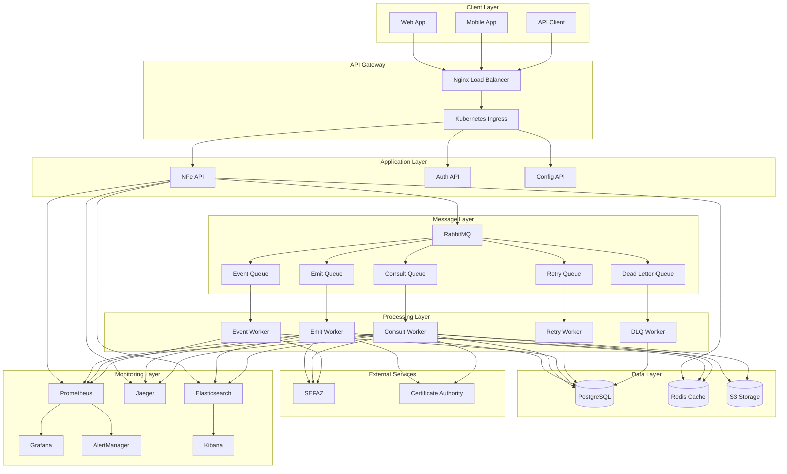
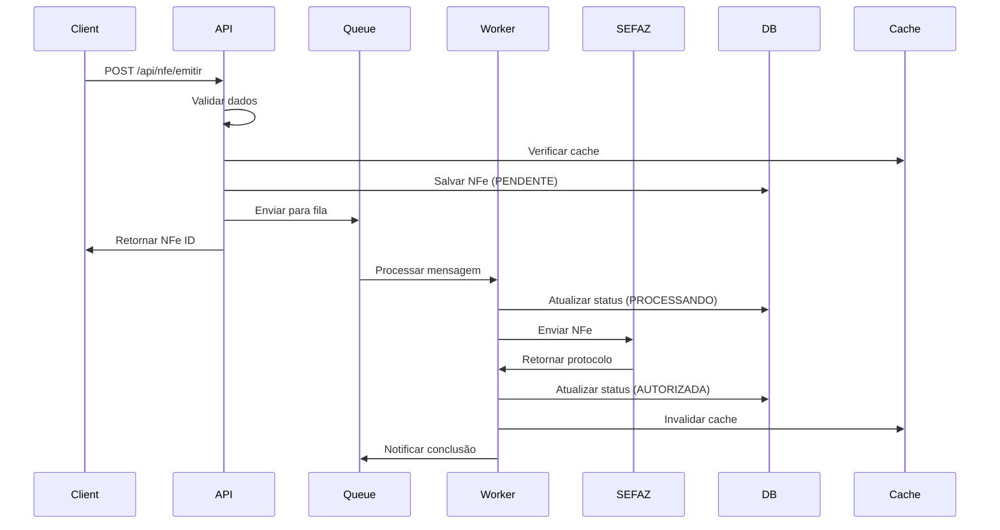
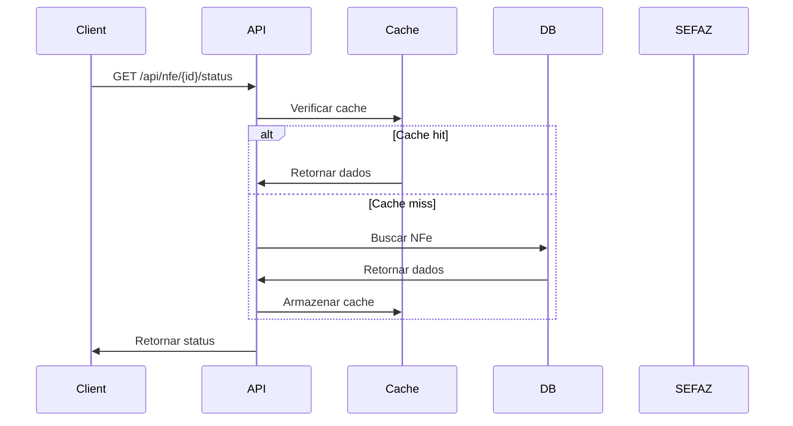
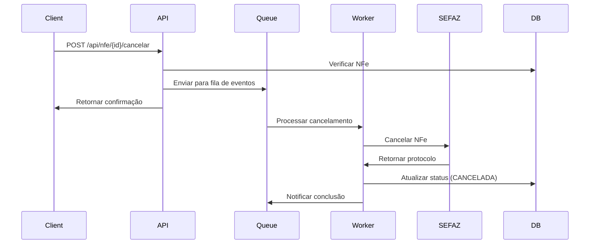

# Fenix NFe API - Documentação de Arquitetura

## 📋 Índice

- [Visão Geral](#visão-geral)
- [Arquitetura do Sistema](#arquitetura-do-sistema)
- [Componentes](#componentes)
- [Fluxos de Processo](#fluxos-de-processo)
- [Decisões Técnicas (ADRs)](#decisões-técnicas-adrs)
- [Padrões de Código](#padrões-de-código)
- [Segurança](#segurança)
- [Monitoramento](#monitoramento)
- [Escalabilidade](#escalabilidade)
- [Disaster Recovery](#disaster-recovery)

## 🔍 Visão Geral

A **Fenix NFe API** é uma arquitetura de microserviços moderna, projetada para alta disponibilidade, escalabilidade e manutenibilidade. O sistema é construído com Spring Boot, containerizado com Docker e orquestrado com Kubernetes.

### Princípios Arquiteturais

- **Microserviços**: Separação clara de responsabilidades
- **Event-Driven**: Processamento assíncrono com filas
- **Cloud-Native**: Projetado para nuvem e containers
- **Observabilidade**: Monitoramento e logging completos
- **Segurança**: Autenticação, autorização e criptografia
- **Resilência**: Circuit breakers, retry e fallback
- **Escalabilidade**: Auto-scaling horizontal e vertical

## 🏗️ Arquitetura do Sistema



## 🧩 Componentes

### 1. API Gateway

**Responsabilidade**: Roteamento, load balancing, rate limiting, SSL termination

**Tecnologias**: Nginx, Kubernetes Ingress

**Características**:
- Load balancing com algoritmo least_conn
- Rate limiting por IP e usuário
- SSL/TLS termination
- CORS configurado
- Security headers
- Health checks

### 2. NFe API

**Responsabilidade**: Endpoints REST, validação, orquestração

**Tecnologias**: Spring Boot, Spring Security, Spring Data JPA

**Características**:
- RESTful API com OpenAPI/Swagger
- Autenticação JWT
- Autorização RBAC
- Validação de dados
- Cache com Redis
- Métricas com Micrometer

### 3. Workers

**Responsabilidade**: Processamento assíncrono de NFe

**Tecnologias**: Spring Boot, Spring AMQP

**Tipos de Workers**:
- **Emit Worker**: Processa emissão de NFe
- **Consult Worker**: Processa consultas
- **Event Worker**: Processa eventos (cancelamento, correção)
- **Retry Worker**: Processa retry de operações falhadas
- **DLQ Worker**: Processa mensagens da Dead Letter Queue

### 4. Message Broker

**Responsabilidade**: Comunicação assíncrona entre componentes

**Tecnologias**: RabbitMQ

**Filas**:
- **nfe.emitir.high**: Alta prioridade para emissão
- **nfe.emitir.normal**: Prioridade normal para emissão
- **nfe.emitir.low**: Baixa prioridade para emissão
- **nfe.consulta**: Consultas de NFe
- **nfe.evento**: Eventos de NFe
- **nfe.retry**: Retry de operações
- **nfe.dlq**: Dead Letter Queue

### 5. Data Layer

**PostgreSQL**:
- Dados transacionais
- Configurações de empresa
- Logs de operações
- Métricas customizadas

**Redis**:
- Cache de configurações
- Cache de sessões
- Rate limiting
- Lock distribuído

**S3**:
- Arquivos XML
- Arquivos PDF
- Backups
- Logs históricos

### 6. External Services

**SEFAZ**:
- Autorização de NFe
- Consulta de status
- Cancelamento
- Inutilização

**Certificate Authority**:
- Validação de certificados
- Renovação automática
- Backup de certificados

## 🔄 Fluxos de Processo

### 1. Fluxo de Emissão de NFe



### 2. Fluxo de Consulta de NFe



### 3. Fluxo de Cancelamento



## 📋 Decisões Técnicas (ADRs)

### ADR-001: Arquitetura de Microserviços

**Status**: Aceito

**Contexto**: Necessidade de escalar diferentes partes do sistema independentemente

**Decisão**: Adotar arquitetura de microserviços com separação clara de responsabilidades

**Consequências**:
- ✅ Maior flexibilidade de deploy
- ✅ Escalabilidade independente
- ✅ Tecnologias específicas por serviço
- ❌ Maior complexidade operacional
- ❌ Necessidade de orquestração

### ADR-002: Processamento Assíncrono

**Status**: Aceito

**Contexto**: Operações de NFe podem demorar e precisam ser resilientes

**Decisão**: Usar filas de mensagens para processamento assíncrono

**Consequências**:
- ✅ Melhor experiência do usuário
- ✅ Resilência a falhas
- ✅ Escalabilidade horizontal
- ❌ Complexidade de debugging
- ❌ Necessidade de gerenciamento de estado

### ADR-003: Containerização com Docker

**Status**: Aceito

**Contexto**: Necessidade de consistência entre ambientes

**Decisão**: Containerizar todas as aplicações com Docker

**Consequências**:
- ✅ Consistência entre ambientes
- ✅ Facilidade de deploy
- ✅ Isolamento de recursos
- ❌ Curva de aprendizado
- ❌ Overhead de containers

### ADR-004: Orquestração com Kubernetes

**Status**: Aceito

**Contexto**: Necessidade de gerenciar containers em escala

**Decisão**: Usar Kubernetes para orquestração

**Consequências**:
- ✅ Auto-scaling
- ✅ Auto-healing
- ✅ Gerenciamento de configurações
- ❌ Complexidade operacional
- ❌ Necessidade de expertise

### ADR-005: Banco de Dados PostgreSQL

**Status**: Aceito

**Contexto**: Necessidade de ACID e suporte a JSON

**Decisão**: Usar PostgreSQL como banco principal

**Consequências**:
- ✅ ACID compliance
- ✅ Suporte a JSON
- ✅ Extensibilidade
- ❌ Complexidade de setup
- ❌ Necessidade de tuning

## 🎨 Padrões de Código

### 1. Estrutura de Pacotes

```
br.com.fenix.nfe
├── api/                    # Controllers e DTOs
│   ├── controller/
│   ├── dto/
│   ├── config/
│   └── security/
├── service/                # Lógica de negócio
│   ├── impl/
│   └── interface/
├── repository/             # Acesso a dados
├── model/                  # Entidades e enums
│   ├── entity/
│   ├── enums/
│   └── queue/
├── worker/                 # Processadores de fila
├── util/                   # Utilitários
├── exception/              # Exceções customizadas
└── config/                 # Configurações
```

### 2. Convenções de Nomenclatura

- **Classes**: PascalCase (ex: `NFeService`)
- **Métodos**: camelCase (ex: `emitirNFe`)
- **Variáveis**: camelCase (ex: `nfeId`)
- **Constantes**: UPPER_SNAKE_CASE (ex: `MAX_RETRY_ATTEMPTS`)
- **Pacotes**: lowercase (ex: `br.com.fenix.nfe`)

### 3. Padrões de Design

- **Repository Pattern**: Para acesso a dados
- **Service Layer**: Para lógica de negócio
- **DTO Pattern**: Para transferência de dados
- **Builder Pattern**: Para construção de objetos complexos
- **Strategy Pattern**: Para diferentes tipos de validação
- **Observer Pattern**: Para eventos de NFe

### 4. Tratamento de Exceções

```java
@RestControllerAdvice
public class GlobalExceptionHandler {
    
    @ExceptionHandler(NFeValidationException.class)
    public ResponseEntity<NFeErrorResponse> handleValidation(NFeValidationException ex) {
        return ResponseEntity.badRequest()
            .body(NFeErrorResponse.builder()
                .code("VALIDATION_ERROR")
                .message(ex.getMessage())
                .category("CLIENT_ERROR")
                .build());
    }
}
```

### 5. Logging

```java
@Slf4j
@Service
public class NFeServiceImpl implements NFeService {
    
    public String emitirNFe(NFeRequest request, String cnpj) {
        log.info("Iniciando emissão de NFe para empresa: {}", cnpj);
        
        try {
            // Lógica de negócio
            log.debug("NFe processada com sucesso: {}", nfeId);
            return nfeId;
        } catch (Exception e) {
            log.error("Erro ao processar NFe para empresa: {}", cnpj, e);
            throw new NFeException("Erro interno", e);
        }
    }
}
```

## 🔒 Segurança

### 1. Autenticação e Autorização

- **JWT Tokens**: Para autenticação stateless
- **RBAC**: Controle de acesso baseado em roles
- **OAuth2**: Para integração com sistemas externos
- **Rate Limiting**: Proteção contra ataques de força bruta

### 2. Criptografia

- **TLS 1.3**: Para comunicação segura
- **AES-256**: Para criptografia de dados sensíveis
- **SHA-256**: Para hashing de senhas
- **RSA-2048**: Para assinatura digital de NFe

### 3. Validação de Dados

- **Bean Validation**: Validação automática de DTOs
- **Sanitização**: Limpeza de dados de entrada
- **Whitelist**: Apenas campos permitidos
- **Rate Limiting**: Limite de requisições por usuário

### 4. Segurança de Infraestrutura

- **Network Policies**: Isolamento de rede
- **Pod Security Policies**: Restrições de segurança
- **Secrets Management**: Gerenciamento seguro de credenciais
- **Image Scanning**: Verificação de vulnerabilidades

## 📊 Monitoramento

### 1. Métricas

- **Application Metrics**: Métricas da aplicação
- **Business Metrics**: Métricas de negócio
- **Infrastructure Metrics**: Métricas de infraestrutura
- **Custom Metrics**: Métricas customizadas

### 2. Logging

- **Structured Logging**: Logs estruturados em JSON
- **Log Levels**: DEBUG, INFO, WARN, ERROR
- **Log Aggregation**: Centralização de logs
- **Log Retention**: Política de retenção

### 3. Tracing

- **Distributed Tracing**: Rastreamento de requisições
- **Span Correlation**: Correlação de spans
- **Performance Analysis**: Análise de performance
- **Error Tracking**: Rastreamento de erros

### 4. Alerting

- **Threshold Alerts**: Alertas por limite
- **Anomaly Detection**: Detecção de anomalias
- **Escalation Policies**: Políticas de escalação
- **Notification Channels**: Canais de notificação

## 📈 Escalabilidade

### 1. Horizontal Scaling

- **Auto-scaling**: Escalonamento automático
- **Load Balancing**: Distribuição de carga
- **Stateless Services**: Serviços sem estado
- **Database Sharding**: Particionamento de dados

### 2. Vertical Scaling

- **Resource Limits**: Limites de recursos
- **Resource Requests**: Solicitações de recursos
- **CPU/Memory Optimization**: Otimização de recursos
- **JVM Tuning**: Ajuste da JVM

### 3. Caching

- **Redis Cache**: Cache distribuído
- **Application Cache**: Cache da aplicação
- **CDN**: Content Delivery Network
- **Database Query Cache**: Cache de consultas

### 4. Database Optimization

- **Indexing**: Criação de índices
- **Query Optimization**: Otimização de consultas
- **Connection Pooling**: Pool de conexões
- **Read Replicas**: Réplicas de leitura

## 🚨 Disaster Recovery

### 1. Backup Strategy

- **Database Backups**: Backup diário do banco
- **File Backups**: Backup de arquivos
- **Configuration Backups**: Backup de configurações
- **Cross-Region Replication**: Replicação entre regiões

### 2. Recovery Procedures

- **RTO (Recovery Time Objective)**: 4 horas
- **RPO (Recovery Point Objective)**: 1 hora
- **Automated Recovery**: Recuperação automática
- **Manual Recovery**: Recuperação manual

### 3. Testing

- **Disaster Recovery Tests**: Testes de DR
- **Backup Validation**: Validação de backups
- **Recovery Procedures**: Procedimentos de recuperação
- **Documentation**: Documentação atualizada

### 4. Monitoring

- **Health Checks**: Verificações de saúde
- **Alerting**: Sistema de alertas
- **Dashboard**: Dashboard de monitoramento
- **Reporting**: Relatórios de status

---

## 📞 Contato

- **Arquitetura**: arquitetura@fenix.com.br
- **DevOps**: devops@fenix.com.br
- **Documentação**: docs@fenix.com.br

## 📄 Licença

Este projeto está licenciado sob a Licença MIT - veja o arquivo [LICENSE](LICENSE) para detalhes.
